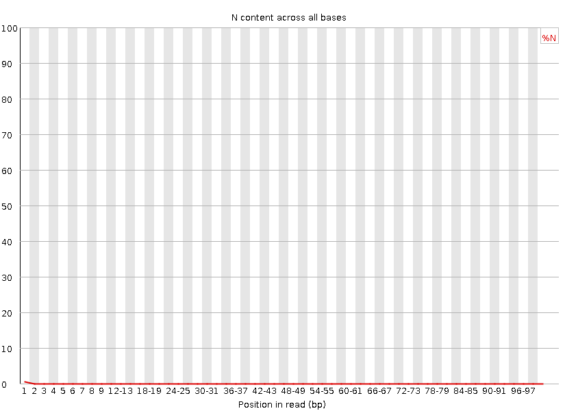

# RNA-seq Quality Assessment Assignment - Bi 623 (Summer 2021)

## Data:
7_2E_fox_S6_L008        
19_3F_fox_S14_L008

## Part 1 – Read quality score distributions

### 7_2E_Fox Read 1 Graphs

### 7_2E_Fox Read 2 Graphs

### 19_3F_Fox Read 1 Graphs

### 19_3F_Fox Read 2 Graphs

## Answers

### Are the per-base N plots consistent with the quality score plots?

    The per-base N plots appear to be mostly consistent with the quality score plots. In all of the above plots we see a rise in the numebr of N's over the first few reads in the N content graphs. This is mirrored in the lower average quality score over these same reads in the quality score graphs.

## Personal Quality Control Graphs

### 7_2E_Fox Read 1 Graphs

### 7_2E_Fox Read 2 Graphs

### 19_3F_Fox Read 1 Graph

### 19_3F_Fox Read 2 Graph

## Answers

### Describe how the FastQC quality score distribution plots compare to your own. If different, propose an explanation. Also, does the runtime differ? If so, why?

    The quality plots are fairly similar to my own. Across all of the data both graphing methods show a clear decrease in quality scores in the early positions that quickly ramps after reading begins. In addition, both  methods show a lower average data quality on 7_2E's 2nd read. Overall, I would say that these graphs mostly mirror each other, however the fastqc graphs present more information in a better way even if the core information is the same. Also, the runtime was signficantly shorter for FastQC as compared to my own algorithm. If I had to guess, it would mostly be due to the inefficency of looping thorugh every line individually without indexing in my algorithm as compared to the FastQC method. 

## Part 2 – Adaptor trimming comparison

###  What proportion of reads (both forward and reverse) were trimmed?

     7_2E read 1:
     Total reads processed:               5,278,425
     Reads with adapters:                   173,473 (3.3%)
     3.3% of total reads were trimmed

     7_2E read 2:
     Total reads processed:               5,278,425
     Reads with adapters:                   212,512 (4.0%)
     4.0% of total reads were trimmed

     19_3F read 1:
     Total reads processed:              16,348,255
     Reads with adapters:                   546,623 (3.3%)
     3.3% of total reads were trimmed 

     19_3F read 2:
     Total reads processed:              16,348,255
     Reads with adapters:                   676,564 (4.1%)
     4.1% of total reads were trimmed

### Sanity check: Use your Unix skills to search for the adapter sequences in your datasets and confirm the expected sequence orientations. Report the commands you used, the reasoning behind them, and how you confirmed the adapter sequences.

    A quick sanity check after googling the adaters that were used in the kit that this experiment with done with is shown below. The easiest way to see if these adatpers show up in the data is a quick a grep. This will hilight where the sequence is found with in the file and will let us look at every line where it is found. We would expect that these adapters should appear after the insert is sequenced so we would not expect many instances of it at the start of the line and instead majority of them at the end. While this method doesn't allow us to  check if the adapter is partially present in our reads it does give us a good indication that is is present in sufficent quantites in our reads.

    Code examples:
    This will visually show where the adapter is found in this data set.

    zcat /projects/bgmp/shared/2017_sequencing/demultiplexed/19_3F_fox_S14_L008_R1_001.fastq.gz | grep 'AGATCGGAAGAGCACACGTCTGAACTCCAGTCA' 

    This will tell us how much of the adater was found at the start of a read. 

    zcat /projects/bgmp/shared/2017_sequencing/demultiplexed/19_3F_fox_S14_L008_R1_001.fastq.gz | grep '^AGATCGGAAGAGCACACGTCTGAACTCCAGTCA' | wc -l

## Mean Distribution Graphs

### 7_2E_Fox Graphs

### 19_3F_Fox Graphs

### Comment on whether you expect R1s and R2s to be adapter-trimmed at different rates.
        I would expect R2 to be trimmed more extensively than R1 due to the fact that R2 had a lower quality score on average. This should result in more results from R2 having bp that need to be removed becuase they are unreliable. This also appears to be supported by graphs that show that read 2 has less full length reads tahn read 1 for both runs. 

## Part 3 – Alignment and strand-specificity

### Mouse Genome Used
        Genome name: Mus_musculus.GRCm39.dna.primary_assembly.fa

        GTF name: Mus_musculus.GRCm39.104.gtf

Count reads that map to features using htseq-count. You should run htseq-count twice: once with --stranded=yes and again with --stranded=no. Use default parameters otherwise.

Demonstrate convincingly whether or not the data are from “strand-specific” RNA-Seq libraries. Include any comands/scripts used. Briefly describe your evidence, using quantitative statements (e.g. "I propose that these data are/are not strand-specific, because X% of the reads are y, as opposed to z.").

Hint - recall ICA4 from Bi621.

To turn in your work for this assignment: Upload your Talapas batch script/code, FastQC plots, mapped/unmapped read counts, counts files generated from htseq-count, answers to questions, and any additional plots/code to github. You should create at most 2 files for submission (R markdown and the rendered pdf file) containing all these elements. The three parts of the assignment should be clearly labeled. Be sure to title and write a figure legend for each image/graph/table you present.